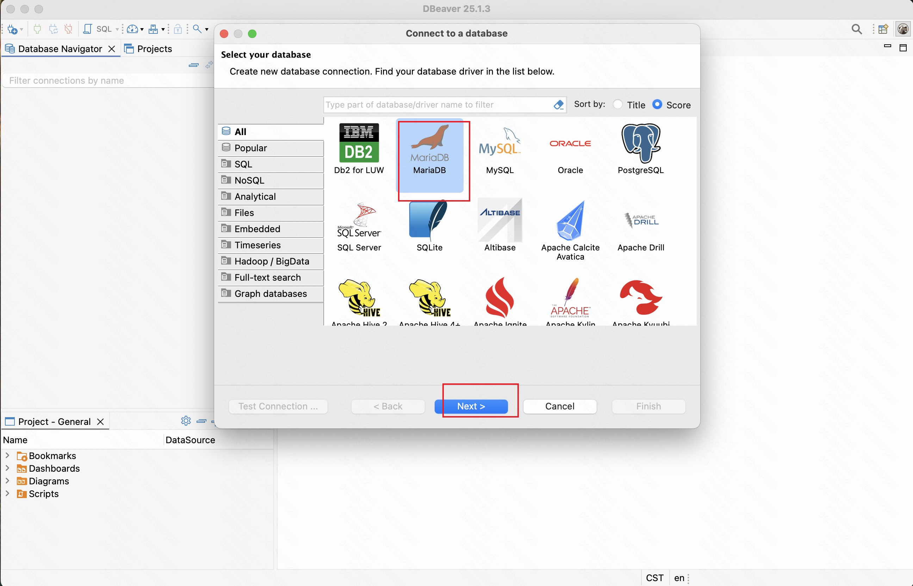
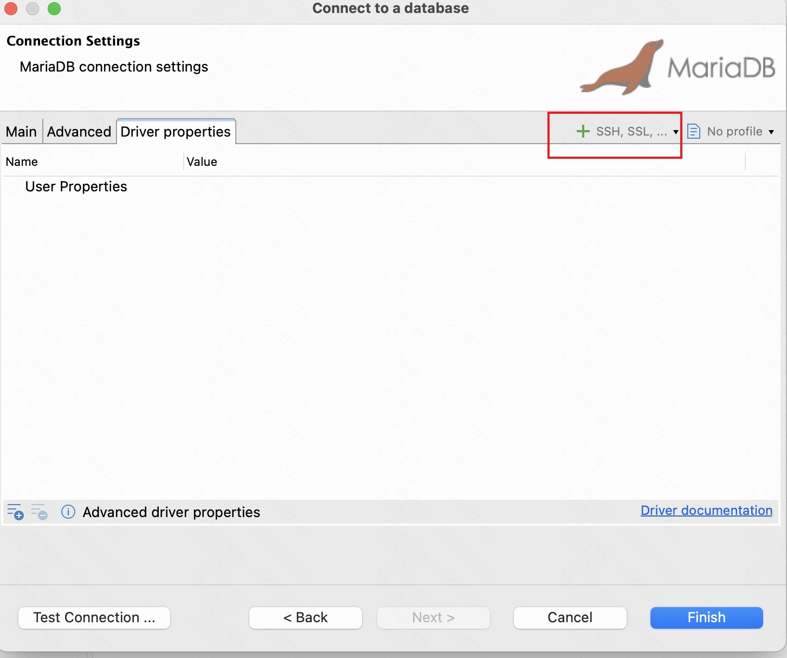
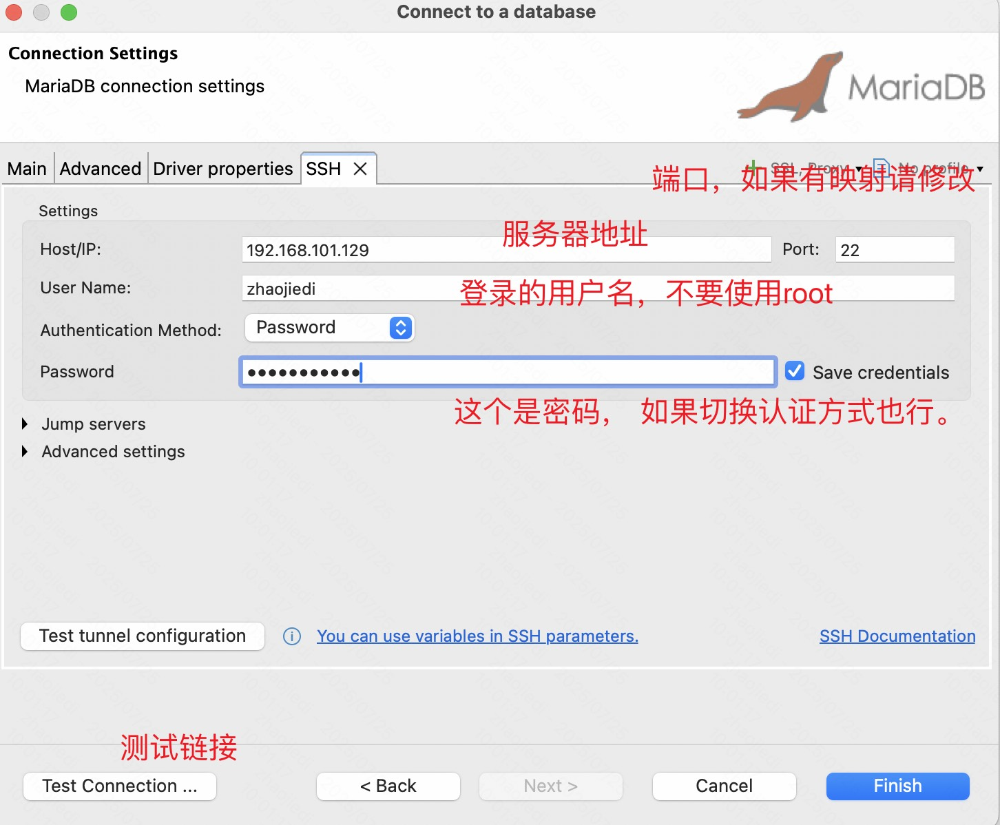
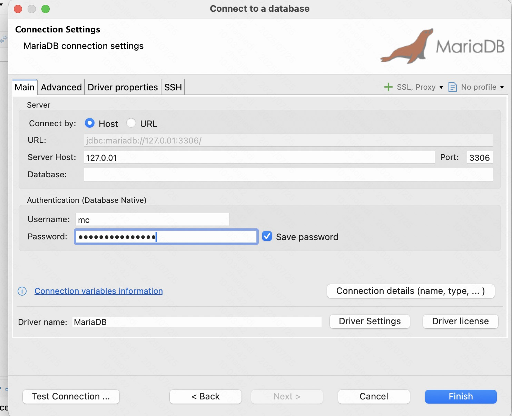
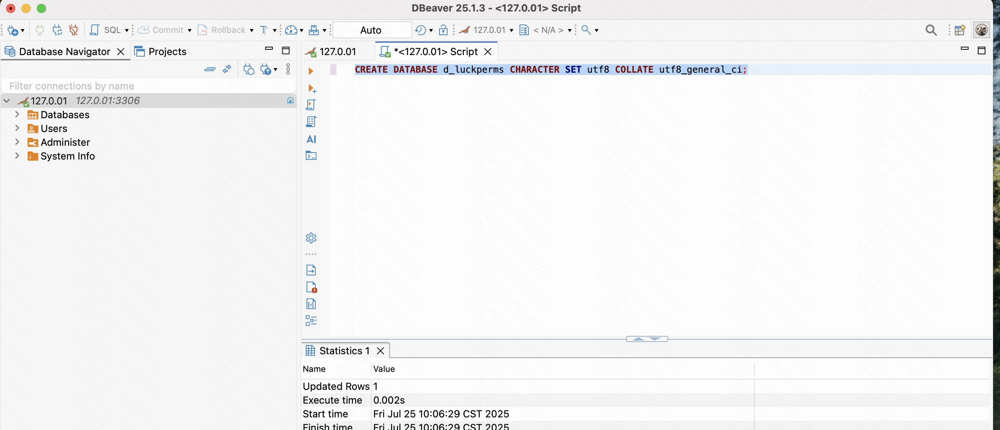
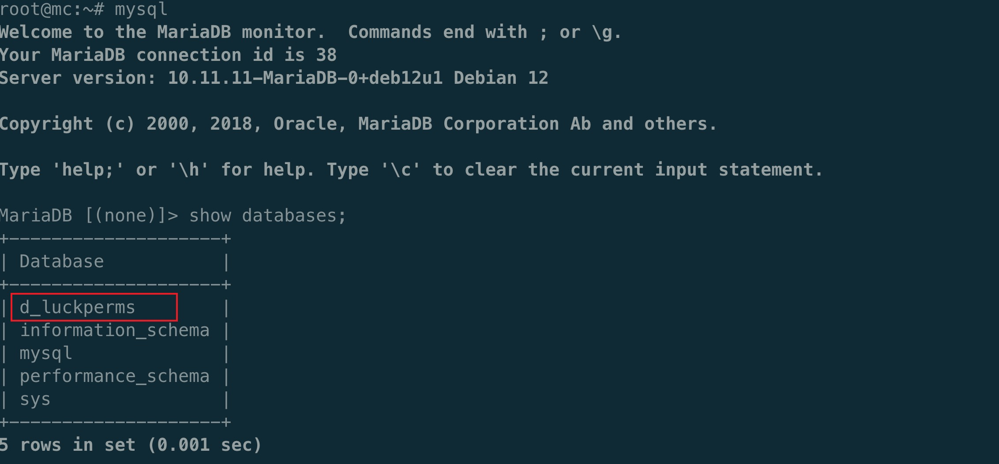

.. _数据库的安装:

.. note:: 这里是开服需要的， 如果只是普通游戏玩家， 不用看这个文档。 

==================================================
数据库的安装
==================================================
我们的MC开服，是需要存储一些数据的， 比如玩家背包数据， 玩家在线数据， 玩家世界数据等。 这些数据都是需要存储在数据库中的。这里我们选择主流的mysql来进行部署。

版本选择
==================================================
我们建议的版本是 MariaDB 10.11.x（长期支持版）版本的， 可以从下面的官方链接获取对应的包。  不要下载太新的版本，后面的插件可能会不兼容。

`mariadb download <https://mariadb.org/download/>`_

centos上安装 mariadb server 
==================================================

.. code-block:: bash 

    # 安装数据库软件
    apt search mariadb-server 
    # 我是debian的，获取到的是mariadb-server/stable 1:10.11版本，这个就可以的
    apt install mariadb-server  

    systemctl stop mariadb-server 
    # 创建基本目录和授权
    mkdir /home/mc/mysql/data -pv 
    mkdir /home/mc/mysql/tmp -pv 
    chown mysql:mysql -R /home/mc/mysql
    # 这里有需要的话，可以修改下配置文件，修改下数据库数据文件存放目录和最大连接数。 

    vim mariadb.conf.d/50-server.cnf
    # 修改如下部分。
    user                    = mysql
    pid-file                = /home/mc/msql/mysqld.pid
    basedir                 = /home/mc/mysql
    datadir                 = /home/mc/mysql/data
    tmpdir                  = /home/mc/mysql/tmp                                                                               
    # 最大链接数
    max_connections=10000 

    # 修改systemd文件
    vim /etc/systemd/system/multi-user.target.wants/mariadb.service
    # service补充
    LimitNOFILE=65535 
    # 修改
    ProtectHome=false

    # 设置数据库开机启动 
    systemctl enable mariadb 
    # 启动数据库 
    systemctl start mariadb 
    # 查看启动状态 
    systemctl status mariadb

    # 查看文件
    root@mc:/etc/mysql/mariadb.conf.d# ls /home/mc/mysql/data/
    aria_log.00000001  ddl_recovery.log   ib_buffer_pool  ibdata1  multi-master.info  mysql_upgrade_info  sys
    aria_log_control   debian-10.11.flag  ib_logfile0     ibtmp1   mysql		  performance_schema

windows上安装 mariadb server 
==================================================
从这个地方下载安装即可。

`mariadb download <https://mariadb.org/download/>`_

账户配置
==================================================
这里创建的账户是mc用户名的， 密码设置一个， 设置的host只能本机登录，  我们后面的远程方案是通过db工具，优先ssh到服务器，然后通过服务器本机连接到db。
降低将db的3306端口暴露给公网的危险性。 

.. code-block:: sql 

    -- 需要你在服务器的终端来执行的，输入mysql进入mysql的终端，然后执行如下sql语句

    -- 创建一个用户
    CREATE USER 'mc'@'127.0.0.1' IDENTIFIED BY 'mc_panda_142857';
    -- 授权下
    GRANT ALL ON *.* TO 'mc'@'127.0.0.1';
    -- 刷新权限
    flush privileges;

工具测试链接
==================================================

--------------------------------------------------
工具下载
--------------------------------------------------

工具一般是下载我们本地电脑上面的， 使用这个工具来管理我们远端的数据库的。

- `dbeaver下载 [免费开源的，推荐的] <https://dbeaver.io/download/>`_ 
- `datagrip下载 [收费的] <https://www.jetbrains.com.cn/datagrip>`_ 

--------------------------------------------------
链接到DB测试
--------------------------------------------------

    
.. code-block:: sql 

    --  创建一个db, 方便luckperm权限插件使用的。 
    CREATE DATABASE d_luckperms CHARACTER SET utf8 COLLATE utf8_general_ci;

附录
==================================================

.. csv-table:: MariaDB 与 MySQL 核心特性对比
   :header: "特性", "MySQL", "MariaDB"
   :widths: 20, 40, 40
   :align: left

   "开源模式", "Oracle 主导，部分闭源组件", "完全开源（GPL/LGPL）"
   "存储引擎", "InnoDB（默认）、MyISAM 等", "InnoDB、Aria（MariaDB 自研）"
   "默认字符集", "5.7 及以前为 latin1，8.0 起为 utf8mb4", "始终默认 utf8mb4"
   "备份工具", "mysqldump、mysqlpump", "mysqldump、mariabackup（更高效）"
   "性能监控", "基础工具", "更丰富的监控插件（如 Query Profiler）"
   "集群方案", "MySQL Cluster、InnoDB Cluster", "Galera Cluster（原生多主复制）"
   "长期支持", "Oracle 官方支持至 2028（MySQL 8.0）", "社区支持至 2031（MariaDB 10.11）"
