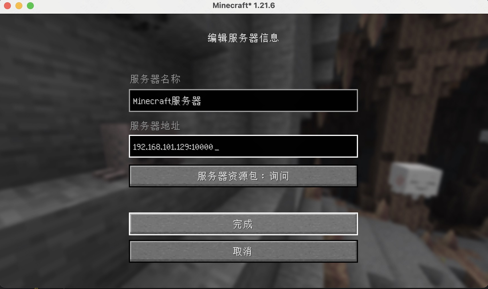
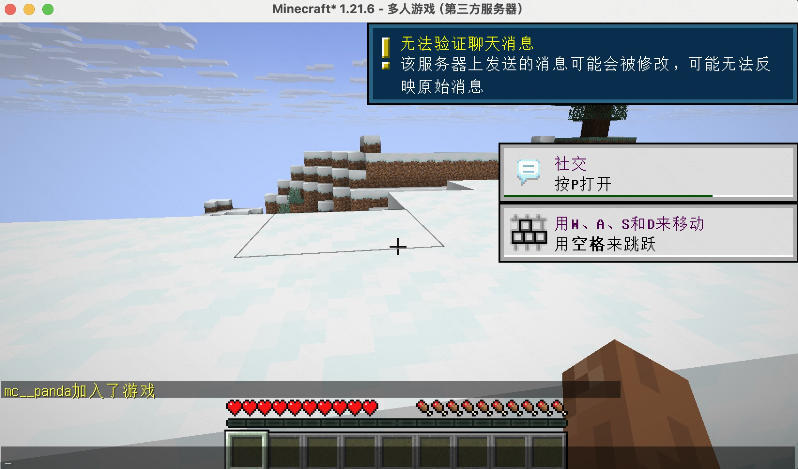

==================================================
登录区的安装
==================================================
这个部分主要说明下如何通过paper的安装包来安装好登录分区。

前置工作
==================================================

截止我写这篇文章的时候，paper的最新版本是1.21.8的版本， 我们就使用这个版本-2-3个小版本来进行安装。 你可以在官网上下载最新的版本。
下载地址：`paper <https://papermc.io/downloads>`_ ,这里我选择1.21.6版本。 

在安装前需要你参考

:ref:`操作系统的选型和安装` 来按照好操作系统，以及系统的一些准备工作。
:ref:`选择安装java` 来安装好java环境，我们版本选择21的版本。

安装步骤
==================================================

从这个页面  `paper download <https://papermc.io/downloads/paper>`_  选择对应的版本下载，我们选择1.21.6版本。

.. code-block:: bash

    # 创建一个主城（login)文件夹, 没有父目录请自行创建好。 
    cd /home/mc/instances/
    mkdir login
    # 进入目录
    cd login/
    # 将下载好的paper核心移动到这个目录
    cp ~/paper-1.21.6.jar  .
    # 或者自己服务器上面下载,链接从paper官网上面获取
    # 
    # 确认文件移动过来了
    ls -l
    # 修改名字为你的分区名字，登录分区为login， 生存一区为sc1, 生存2区位sc2, 地皮一区为dp1 ，详细的请参考文章前面的规划端口名称部分。
    mv paper-1.21.6-48.jar  login.jar
    # 第一次尝试启动下
    java -jar login.jar
    # 修改eula文件，遵守协议
    sed -i  's@eula=false@eula=true@g' eula.txt
    # 确认文件修改完毕
    cat eula.txt
    # 在此尝试启动下
    java -jar login.jar

    # 启动后， 会有一个闪动，等待你的输入，我们这里不做输入， 直接ctrl +C 关闭。 

    # 看下默认的配置主配置文件
    cat server.properties
    # 这里按照我们规划的端口，进行修改端口
    sed -i 's@server-port=25565@server-port=10000@g' server.properties
    sed -i 's@query.port=25565@query.port=10000@g' server.properties
    sed -i 's@rcon.port=25575@rcon.port=11000@g' server.properties
    sed -i 's@enable-rcon=false@enable-rcon=true@g' server.properties
    sed -i 's@^rcon\.password=$@rcon.password=mc_panda_142857@g' server.properties
    sed -i 's@enforce-secure-profile=true@enforce-secure-profile=false@g' server.properties
    # 修改服务器为离线服务器， 这里不管你使用正版还是离线，都要设置为离线的， 开正版可以去入口的proxy去开。
    sed -i 's@online-mode=true@online-mode=false@g' server.properties
    # 尝试再次启动
    java -jar login.jar

联机测试下
==================================================
这个我们需要打开一个启动器，然后版本选择1.21.6的版本，然后链接到具体的ip:10000端口上来， 看看是否可以正常链接。
如果可以正常链接，进入世界，那么就说明我们的登录区安装成功了。

 .. note::  注意，我们的端口修改了， 所以本地测试的时候注意补充端口。 
 

.. warning:: 这里我们登录区，暂时还没有配置任何登录相关的插件，后续会完善，不在这个文档里面继续说明。

整理一个启动脚本
==================================================
整理启动脚本后，我们后面就不用每次就要ctrl+c 关闭， 只需要通过命令启动和管理， 毕竟后面分区比较多了， 一个一个操作不太现实的。 

.. code-block:: bash 

    # 提前放置好mc_control.sh文件。 具体可以参考 
    zhaojiedi@mc:/etc/init.d$ sudo ln -s /home/mc/My_Study_MC/source/开服教程/codes/scripts/sysv/mc_control.sh mc_proxy
    zhaojiedi@mc:/etc/init.d$ sudo ln -s /home/mc/My_Study_MC/source/开服教程/codes/scripts/sysv/mc_control.sh mc_login
    zhaojiedi@mc:/etc/init.d$ sudo ln -s /home/mc/My_Study_MC/source/开服教程/codes/scripts/sysv/mc_control.sh mc_sc1
    zhaojiedi@mc:/etc/init.d$ sudo ln -s /home/mc/My_Study_MC/source/开服教程/codes/scripts/sysv/mc_control.sh mc_sc2
    zhaojiedi@mc:/etc/init.d$ sudo ln -s /home/mc/My_Study_MC/source/开服教程/codes/scripts/sysv/mc_control.sh mc_dp1

:download:`mc_control.sh <../codes/scripts/sysv/mc_control.sh>` 

