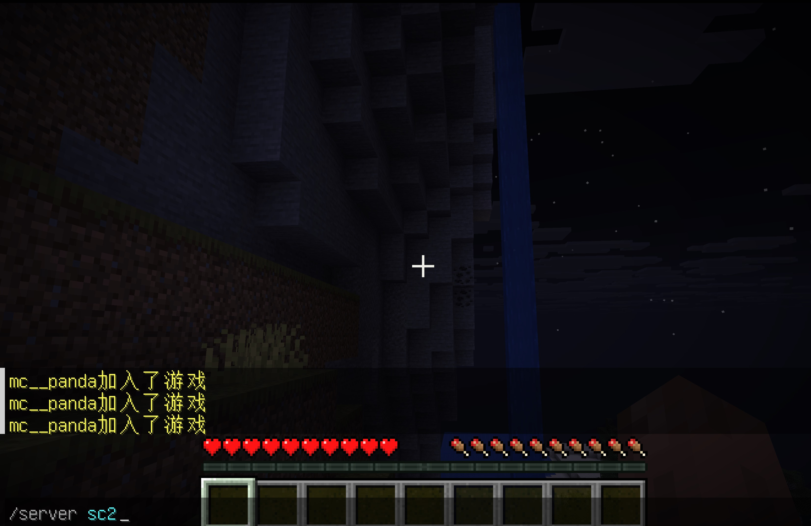

.. _Proxy安装:
==================================================
Proxy 安装
==================================================

本节介绍如何在群组服环境下安装和配置Velocity 为例），实现多个分区（生存1区，生存2区、地皮1区）互通，提升服务器可扩展性和玩家体验。

简介
==================================================
Proxy（代理端）是实现 Minecraft 群组服（多分区/多世界）架构的核心组件。常见的 Proxy 有 Velocity、BungeeCord、Waterfall 等。  
本教程以 Velocity 为例，演示如何搭建 Proxy 端、配置分区转发、实现玩家无缝切换分区。

参考资料
==================================================
- Velocity 官方文档：https://docs.papermc.io/velocity/
- Player Information Forwarding：https://docs.papermc.io/velocity/player-information-forwarding/
- PaperMC 官方文档：https://docs.papermc.io/paper/

Proxy 安装
==================================================
1. 下载 Velocity 最新版本  
   可在 [velocity官方页面](https://papermc.io/downloads/velocity) 获取下载链接。

   .. code-block:: bash

      wget https://fill-data.papermc.io/v1/objects/f82780ce33035ebe3d6ea7981f0e6e8a3e41a64f2080ef5c0f1266fada03cbee/velocity-3.4.0-SNAPSHOT-522.jar

2. 创建 proxy 目录并放置 jar 包

   .. code-block:: bash

      mkdir /home/mc/instances/proxy
      cp velocity-3.4.0-SNAPSHOT-522.jar /home/mc/instances/proxy/proxy.jar
      cd /home/mc/instances/proxy/

3. 首次启动，生成默认配置

   .. code-block:: bash

      java -jar proxy.jar

4. 查看生成的配置文件（如 velocity.toml）

配置文件修改
==================================================
1. 备份默认配置，便于回滚

   .. code-block:: bash

      cp velocity.toml velocity.toml.default

2. 主要配置项说明（以 diff 形式展示常用修改项）

   .. code-block:: diff

      16c16
      < online-mode = false
      ---
      > online-mode = true
      37c37
      < player-info-forwarding-mode = "modern"
      ---
      > player-info-forwarding-mode = "NONE"
      80,83c80,82
      < dl1 = "127.0.0.1:10001"
      < dp1 = "127.0.0.1:20001"
      < sc1 = "127.0.0.1:30001"
      < sc2 = "127.0.0.1:30002"
      ---
      > lobby = "127.0.0.1:30066"
      > factions = "127.0.0.1:30067"
      > minigames = "127.0.0.1:30068"
      87c86
      <     "login"
      ---
      >     "lobby"
      91a91,99
      > "lobby.example.com" = [
      >     "lobby"
      > ]
      > "factions.example.com" = [
      >     "factions"
      > ]
      > "minigames.example.com" = [
      >     "minigames"
      > ]
      117c125
      < tcp-fast-open = true
      ---
      > tcp-fast-open = false

关键配置说明：

- online-mode = false：Proxy 端统一验证，后端分区需关闭正版验证  
- player-info-forwarding-mode = "modern"：推荐使用 modern，保证皮肤/正版信息转发  
- tcp-fast-open：Linux 可开启，Windows 建议关闭

配置联动（Proxy 与分区服务端）
==================================================
1. 生成并设置 forwarding.secret

   .. code-block:: bash

      echo "panda_mc_142857" >forwarding.secret

2. 修改各分区（如 login、sc1、sc2、dp1 等）的 Paper 配置

   .. code-block:: diff

      # config/paper-global.yml
      113c113
      <     online-mode: false
      ---
      >     online-mode: true
      116,118c116,118
      <     enabled: true
      <     online-mode: false
      <     secret: panda_mc_142857
      ---
      >     enabled: false
      >     online-mode: true
      >     secret: ''

.. note:: 各分区的 `online-mode` 必须为 false, 而且`secret` 填写与 forwarding.secret 一致， 避免proxy和分区不通。

1. 重启所有服务端

   .. code-block:: bash

      systemctl restart mc_proxy mc_dp1 mc_login mc_sc1 mc_sc2

2. 推荐设置快捷命令到 /etc/profile

   .. code-block:: bash

      echo 'alias mc_restart="systemctl restart mc_proxy mc_dp1 mc_login mc_sc1 mc_sc2"' >> /etc/profile
      source /etc/profile

验证效果
==================================================
- 启动所有分区和 proxy 后，玩家可通过 `/server sc2` 等命令在 dl1(登录1区) 与 sc2（生存2区）间切换。

常见问题 QA
==================================================
:Q1:  java.lang.IllegalStateException: Backend server is online-mode!  
:A1:  后端分区的 server.properties 里的 online-mode 必须为 false

:Q2:  lost connection: Unable to verify player details  
:A2:  proxy 和分区的 secret 不一致，核对 velocity 的 forwarding.secret 和各分区 paper-global.yml 的 secret

:Q3:  玩家皮肤/正版信息丢失  
:A3:  player-info-forwarding-mode 建议设为 modern，且 proxy 与后端配置一致

:Q4:  端口冲突或无法连接  
:A4:  检查各分区端口是否唯一，防火墙是否放行。

