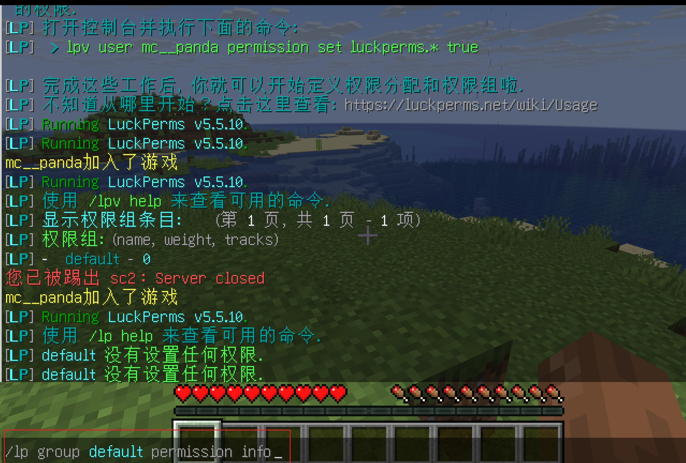
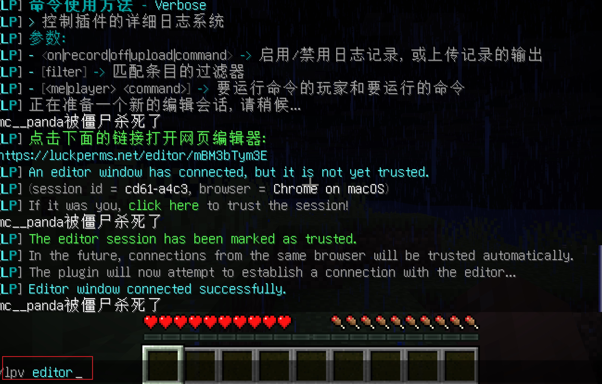

==================================================
权限插件安装
==================================================
权限插件，基本上毫无疑问，都是选择的luckperm吧。
`luckperm官方网站 <https://luckperms.net/wiki/Home>`_ 

在安装luckperm 前，你需要准备一个数据库， mariadb的，或者mysql的，详情参考. 

:ref:`数据库的安装`  需要提前创建好d_luckperms这个数据库的。 

luckperm 下载
==================================================

luckperm的下载地址 `luckperm 下载地址 <https://luckperms.net/download>`_  可以进行下载，我们需要下载2个版本的， 一个是代理端需要的velocity版本，一个是paper端需要的bukkit版本。

在proxy上面安装luckperm
==================================================

.. code-block:: bash 

    cp /home/mc/softs/LuckPerms-Velocity-5.5.10.jar /home/mc/instances/proxy/plugins/
    systemctl restart mc_proxy
    cd /home/mc/instances/proxy/plugins/luckperms
    ls
    cp config.yml  config.yml.default

    root@mc:/home/mc/instances/proxy/plugins/luckperms# diff config.yml config.yml.default
    76c76
    < storage-method: MariaDB
    ---
    > storage-method: h2
    88c88
    <   address: 127.0.0.1
    ---
    >   address: localhost
    92c92
    <   database: d_luckperms
    ---
    >   database: minecraft
    95,96c95,96
    <   username: mc
    <   password: 'mc_panda_142857'
    ---
    >   username: root
    >   password: ''
    108c108
    <     maximum-pool-size: 1000
    ---
    >     maximum-pool-size: 10
    114c114
    <     minimum-idle: 100
    ---
    >     minimum-idle: 10

    # 重启proxy 
    systemctl restart mc_proxy 
    # 查看日志
    tail -f logs/latest.log
    # 确认luckperm启动没有问题， 启动后会在d_luckperms的这个db下创建一些表。 可以核对核对。

在server上面安装luckperm
==================================================
上面安装了到了proxy上面，但是每个后端的分区也是需要安装的， 这里我安装一个login,其他的直接复制整个目录，做简单修改即可。 

.. code-block:: bash 

    cp /home/mc/softs/LuckPerms-Bukkit-5.5.10.jar  /home/mc/instances/login/plugins/
    systemctl restart mc_login 
    cd /home/mc/instances/login/plugins
    cp config.yml  config.yml.default
    # 编辑文件， 具体参考上面的配置项。  注意这里要比上面多修改一个server的字段， 因为proxy的就是proxy不用动，但是各个分区的都需要修改。

    root@mc:/home/mc/instances/login/plugins/LuckPerms# diff config.yml config.yml.default
    34c34
    < server: login
    ---
    > server: global
    86c86
    < storage-method: MariaDB
    ---
    > storage-method: h2
    98c98
    <   address: 127.0.0.1
    ---
    >   address: localhost
    102c102
    <   database: d_luckperms
    ---
    >   database: minecraft
    105,106c105,106
    <   username: mc
    <   password: 'mc_panda_142857'
    ---
    >   username: root
    >   password: ''
    118c118
    <     maximum-pool-size: 10000
    ---
    >     maximum-pool-size: 10
    124c124
    <     minimum-idle: 100
    ---
    >     minimum-idle: 10

    # 重启
    systemctl restart mc_login 
    # 查看日志
    tail -f logs/latest.log
    # 确认luckperm启动没有问题. 

    # 其他的分区安装
    cp -r  /home/mc/instances/login/plugins/LuckPerms* /home/mc/instances/dp1/plugins/
    cp -r  /home/mc/instances/login/plugins/LuckPerms* /home/mc/instances/sc1/plugins/
    cp -r  /home/mc/instances/login/plugins/LuckPerms* /home/mc/instances/sc2/plugins/
    sed -i 's@server: login@server: dp1@g'  /home/mc/instances/dp1/plugins/LuckPerms/config.yml
    sed -i 's@server: login@server: sc1@g'  /home/mc/instances/sc1/plugins/LuckPerms/config.yml
    sed -i 's@server: login@server: sc2@g'  /home/mc/instances/sc2/plugins/LuckPerms/config.yml
    systemctl restart mc_login mc_dp1 mc_sc1 mc_sc2

    # 查看各个server的日志情况，确保无错误。

添加luckperm的权限管理能力
==================================================
通过mc的客户端工具，是因为默认是没有权限的，需要终端去授权才可以的。 

.. code-block:: bash 

    systemctl stop mc_sc2
    clear
    java -jar sc2.jar
    > lp user mc__panda permission set luckperms.* true
    [11:54:38 INFO]: [LP] Set luckperms.* to true for mc__panda in context global.
    [11:54:38 INFO]: [LuckPerms] [Messaging] Sending log with id: 1273133a-e2f3-4d80-adb4-102451aabe88
    [11:54:38 INFO]: [LuckPerms] [Messaging] Sending user ping for 'mc__panda' with id: 96ddb5e3-dcd1-4e79-b10c-44a619fc9d18

每次去终端去操作也不方便， 如果单个命令，可以在页面设置权限。 

详细的权限设置，可以参考  `luckperms官方文档 <https://luckperms.net/wiki/Permission-Commands>`_ 

设置用户组和权限
==================================================

需要参考 :ref:`用户级别规划` 

.. code-block:: bash 

    # 先创建我们几个预设的组。 其中default组默认就存在了，我们就不创建了。
    /lp creategroup owner 10000 Owner
    # owner 给权限权限
    /lp group owner permission set *.* true 

    # 修改default的显示名字为Lv0,保持和其他的等级显示一致。
    /lp group default setdisplayname 凡人境
    /lp creategroup lv_lianqiqi_1 20 炼气期1层
    /lp creategroup lv_lianqiqi_2 30 炼气期2层
    /lp creategroup lv_lianqiqi_3 40 炼气期3层
    /lp creategroup lv_lianqiqi_4 50 炼气期4层
    /lp creategroup lv_lianqiqi_5 60 炼气期5层
    /lp creategroup lv_lianqiqi_6 70 炼气期6层
    /lp creategroup lv_lianqiqi_7 80 炼气期7层
    /lp creategroup lv_lianqiqi_8 90 炼气期8层
    /lp creategroup lv_lianqiqi_9 100 炼气期9层
    /lp creategroup lv_zhujiqi_1 110 筑基期1层
    /lp creategroup lv_zhujiqi_2 120 筑基期2层
    /lp creategroup lv_zhujiqi_3 130 筑基期3层
    /lp creategroup lv_zhujiqi_4 140 筑基期4层
    /lp creategroup lv_zhujiqi_5 150 筑基期5层
    /lp creategroup lv_zhujiqi_6 160 筑基期6层
    /lp creategroup lv_zhujiqi_7 170 筑基期7层
    /lp creategroup lv_zhujiqi_8 180 筑基期8层
    /lp creategroup lv_zhujiqi_9 190 筑基期9层
    /lp creategroup lv_jindanqi_1 200 金丹期初期
    /lp creategroup lv_jindanqi_2 210 金丹期中期
    /lp creategroup lv_jindanqi_3 220 金丹期后期
    /lp creategroup lv_yuanyingqi_1 230 元婴期初期
    /lp creategroup lv_yuanyingqi_2 240 元婴期中期
    /lp creategroup lv_yuanyingqi_3 250 元婴期后期
    /lp creategroup lv_huashenqi_1 260 化神期初期
    /lp creategroup lv_huashenqi_2 270 化神期中期
    /lp creategroup lv_huashenqi_3 280 化神期后期
    /lp creategroup lv_lianxuqi_1 290 炼虚期初期
    /lp creategroup lv_lianxuqi_2 300 炼虚期中期
    /lp creategroup lv_lianxuqi_3 310 炼虚期后期
    /lp creategroup lv_hetiqi_1 320 合体期初期
    /lp creategroup lv_hetiqi_2 330 合体期中期
    /lp creategroup lv_hetiqi_3 340 合体期后期
    /lp creategroup lv_dachengqi_1 350 大乘期初期
    /lp creategroup lv_dachengqi_2 360 大乘期中期
    /lp creategroup lv_dachengqi_3 370 大乘期后期
    /lp creategroup lv_dujieqi_1 380 渡劫期初期
    /lp creategroup lv_dujieqi_2 390 渡劫期中期
    /lp creategroup lv_dujieqi_3 400 渡劫期后期

    # 创建几个实际的权限组。proxy:代理端权限分组
    /lpb creategroup g_proxy 0 g_proxy
    /lpb group g_proxy permission set velocity.command.server true 

    # 设置权限组的依赖关系
    /lpb group default parent add g_proxy
    /lp group lv_lianqiqi_1 parent add default
    /lp group lv_lianqiqi_2 parent add lv_lianqiqi_1
    /lp group lv_lianqiqi_3 parent add lv_lianqiqi_2
    /lp group lv_lianqiqi_4 parent add lv_lianqiqi_3
    /lp group lv_lianqiqi_5 parent add lv_lianqiqi_4
    /lp group lv_lianqiqi_6 parent add lv_lianqiqi_5
    /lp group lv_lianqiqi_7 parent add lv_lianqiqi_6
    /lp group lv_lianqiqi_8 parent add lv_lianqiqi_7
    /lp group lv_lianqiqi_9 parent add lv_lianqiqi_8
    /lp group lv_zhujiqi_1 parent add lv_lianqiqi_9
    /lp group lv_zhujiqi_2 parent add lv_zhujiqi_1
    /lp group lv_zhujiqi_3 parent add lv_zhujiqi_2
    /lp group lv_zhujiqi_4 parent add lv_zhujiqi_3
    /lp group lv_zhujiqi_5 parent add lv_zhujiqi_4
    /lp group lv_zhujiqi_6 parent add lv_zhujiqi_5
    /lp group lv_zhujiqi_7 parent add lv_zhujiqi_6
    /lp group lv_zhujiqi_8 parent add lv_zhujiqi_7
    /lp group lv_zhujiqi_9 parent add lv_zhujiqi_8
    /lp group lv_jindanqi_1 parent add lv_zhujiqi_9
    /lp group lv_jindanqi_2 parent add lv_jindanqi_1
    /lp group lv_jindanqi_3 parent add lv_jindanqi_2
    /lp group lv_yuanyingqi_1 parent add lv_jindanqi_3
    /lp group lv_yuanyingqi_2 parent add lv_yuanyingqi_1
    /lp group lv_yuanyingqi_3 parent add lv_yuanyingqi_2
    /lp group lv_huashenqi_1 parent add lv_yuanyingqi_3
    /lp group lv_huashenqi_2 parent add lv_huashenqi_1
    /lp group lv_huashenqi_3 parent add lv_huashenqi_2
    /lp group lv_lianxuqi_1 parent add lv_huashenqi_3
    /lp group lv_lianxuqi_2 parent add lv_lianxuqi_1
    /lp group lv_lianxuqi_3 parent add lv_lianxuqi_2
    /lp group lv_hetiqi_1 parent add lv_lianxuqi_3
    /lp group lv_hetiqi_2 parent add lv_hetiqi_1
    /lp group lv_hetiqi_3 parent add lv_hetiqi_2
    /lp group lv_dachengqi_1 parent add lv_hetiqi_3
    /lp group lv_dachengqi_2 parent add lv_dachengqi_1
    /lp group lv_dachengqi_3 parent add lv_dachengqi_2
    /lp group lv_dujieqi_1 parent add lv_dachengqi_3
    /lp group lv_dujieqi_2 parent add lv_dujieqi_1
    /lp group lv_dujieqi_3 parent add lv_dujieqi_2

    # 前缀信息后面再设置。

批量执行方法
==================================================
`脚本辅助管理 <https://github.com/zhaojiedi1992/My_Study_MC/tree/main/source/%E5%BC%80%E6%9C%8D%E6%95%99%E7%A8%8B/codes/scriptsk>`_ 

你可以将这些文件都下载下来， 然后方便后面添加权限。

.. code-block:: bash 

    # 读取command文件， 然后去login分区，添加下权限， 因为权限是存在mysql的， 任何分区执行一次就行的。 
    cat command.list.txt |while read file; do bash exec_one_cmd.sh  "$file" ; done

图形化编辑权限
==================================================
可以在游戏里面，想聊天一样的方式， 输入/lpv editor 即可， 他会给你一个链接，你通过浏览器打开， 就可以编辑了。 

获取权限树
==================================================
可以游戏内使用/lpv tree 或者lp tree 获取权限树信息，方便查看后面的插件提供了哪些权限， 然后针对性授权。

权限debug
==================================================

不知道一个操作需要什么权限了，可以如下方式获取指令需要的权限节点是啥。

.. code-block:: bash 

    /lp verbose record [筛选条件]
    执行一系列需要权限的操作
    /lp verbose paste
    打开生成的 URL