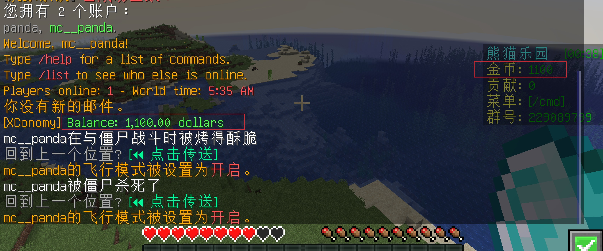

==================================================
经济插件安装
==================================================
虽然 EssentialsX 也提供了经济能力，但无法跨分区同步，推荐使用专门的经济插件实现全服统一账户。建议每个分区都连接同一个数据库，实现经济数据全局唯一。

插件简介
==================================================
- XConomy：轻量级经济插件，支持 MySQL 数据库后端
- 纯经济功能，无多余依赖，性能优异
- 支持 Vault、PlaceholderAPI 联动
- 免费开源，长期维护

- SpigotMC: https://www.spigotmc.org/resources/xconomy.75669/
- GitHub: https://github.com/YiC200333/XConomy

.. note:: 有个 XConomy++ 版本，不建议安装，推荐使用原版，功能纯粹稳定。

安装步骤
==================================================
1. 下载 XConomy 的 zip 包，解压后获取适用于 Paper 的 jar 包
2. 将 jar 包放到所有分区的 plugins 目录
3. 重启所有服务端

创建数据库
==================================================
.. code-block:: sql 

    CREATE DATABASE d_xconomy CHARACTER SET utf8 COLLATE utf8_general_ci;

配置修改
==================================================
主要修改数据库连接部分，其他配置可按需调整。

.. code-block:: diff

    # config.yml 语言设置
    19c19
    <   language: Chinese
    ---
    >   language: English
    102c102
    <   enable: true
    ---
    >   enable: false

    # database.yml 需设置数据库连接信息，建议使用 MySQL，其他如 redis、h2 不建议动
    # usepool: true 必须设置，否则会报错

测试方法
==================================================
1. 在 dl1 分区执行 `/money` 查看余额
2. 使用 `/eco give <玩家ID> 100` 增加金币
3. 切换到其他分区（如 `/server sc1`），再次执行 `/money`，确认余额同步

权限配置
==================================================
这个插件，目前没有啥权限授予的， 不过还是创建一个虚拟组。 

.. code-block:: bash 

    /lp creategroup g_xconomy
    /lp group default parent add g_xconomy
    /lp group g_xconomy permission set xconomy.user true 

常见问题 QA
==================================================
:Q1: java.lang.NullPointerException: Cannot invoke "java.sql.Connection.prepareStatement(String)" because "connection" is null  
:A1: 请在 database.yml 设置 usepool: true，然后重启服务端。

:Q2: 怎么核对我的 /money 命令是使用 EssentialsX 还是 XConomy 的？  
:A2:  
    1. 查看服务器日志，确认命令来源  
    2. 使用 LuckPerms 的 debug 功能 `/lp verbose command <玩家> <命令>`  
    3. 通过插件管理工具查看命令路径

:Q3: 经济数据不同步？  
:A3: 检查所有分区是否都连接同一个数据库，配置是否一致。

:Q4: PlaceholderAPI 变量无效？  
:A4: 检查 PlaceholderAPI 是否安装并加载 Vault 或者 XConomy 扩展。

