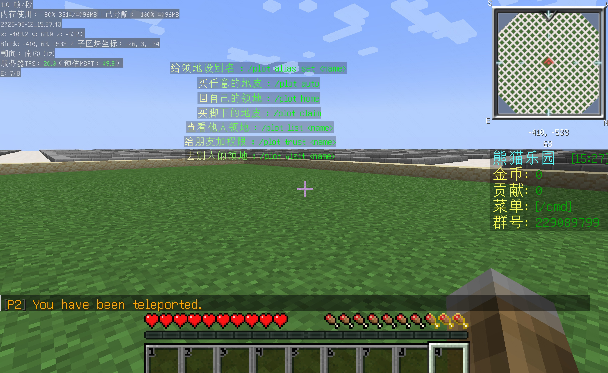

==================================================
全息图插件安装
==================================================

DecentHolograms 是一款高性能、功能丰富的全息图插件，可用于展示公告、指令提示、排行榜等信息，广泛应用于主城、地皮、生存等各类分区。

插件简介
==================================================
- 支持多种线条类型（文本、物品、实体等）
- 行高、偏移、分页等高度自定义
- 支持权限控制、显示范围、PlaceholderAPI 占位符
- 支持动画、损坏/治疗显示等高级功能
- 完全基于假数据包，无实体，极致性能
- 提供强大 API，便于二次开发
- 免费开源，长期维护

效果图
==================================================

关键链接
==================================================
- Wiki: https://wiki.decentholograms.eu/
- GitHub: https://github.com/DecentSoftware-eu/DecentHolograms
- Modrinth: https://modrinth.com/plugin/decentholograms

安装步骤
==================================================
1. 从 Modrinth 或 GitHub Releases 下载 DecentHolograms.jar
2. 放到所有需要全息图的分区 plugins 目录
3. 重启服务端，自动生成配置文件

.. code-block:: bash

    wget https://cdn.modrinth.com/data/6uZwvGmP/versions/latest/DecentHolograms.jar
    cp DecentHolograms.jar /home/mc/instances/dp1/plugins/
    cp DecentHolograms.jar /home/mc/instances/sc1/plugins/
    # 其他分区同理

配置调整
==================================================
- 配置文件位于 plugins/DecentHolograms/config.yml
- 推荐关闭动画中的占位符（如无需求）以提升性能
- 可开启 damage-display、healing-display 等功能

.. code-block:: diff

    allow-placeholders-inside-animations: false
    damage-display:
      enable: true
    healing-display:
      enable: true

游戏内配置与常用指令
==================================================
完整指令请参考官方 Wiki： https://wiki.decentholograms.eu/general/commands/

**地皮1区示例：**

.. code-block:: bash

    # 进入地皮一区，选择合适位置
    /dh hologram create dp_help
    /dh l add dp_help 1 <#FFFFAA>买任意的地皮  :</#00FF00> <#00FF00>/plot auto</#00FF00>
    /dh l add dp_help 1 <#FFFFAA>回自己的领地  :</#00FF00> <#00FF00>/plot home</#00FF00>
    /dh l add dp_help 1 <#FFFFAA>买脚下的地皮  :</#00FF00> <#00FF00>/plot claim</#00FF00>
    /dh l add dp_help 1 <#FFFFAA>查看他人领地  :</#00FF00> <#00FF00>/plot list <name></#00FF00>
    /dh l add dp_help 1 <#FFFFAA>给朋友加权限  :</#00FF00> <#00FF00>/plot trust <name></#00FF00>
    /dh l add dp_help 1 <#FFFFAA>去别人的领地  :</#00FF00> <#00FF00>/plot visit <name></#00FF00>
    /dh l set dp_help 1   <#FFFFAA>给领地设别名  :</#00FF00> <#00FF00>/plot alias set <name></#00FF00>
    # 站在需要的位置，放三格子物品，然后站上去输入下面内容
    /dh movehere dp_help

**其他分区建议：**
- 登录区、生存区等可结合 NPC 插件展示功能入口，无需重复设置全息图

进阶用法
==================================================
- 支持多页全息图、定时切换、动画、物品展示等
- 可与 PlaceholderAPI 联动，动态展示玩家数据、经济、排行榜等
- 支持权限分级，部分内容仅特定玩家可见

权限配置
==================================================
这个只是管理员需要的，普通用户不需要额外权限的。

常见问题 QA
==================================================
:Q1: 全息图不显示或报错？  
:A1: 检查插件是否安装、配置文件格式是否正确，查看服务端日志。

:Q2: PlaceholderAPI 变量无效？  
:A2: 检查 PlaceholderAPI 是否安装并加载对应扩展。

:Q3: 玩家无法编辑全息图？  
:A3: 检查 LuckPerms 权限配置，确认已授权 decentholograms.admin。

:Q4: 全息图内容重叠或位置异常？  
:A4: 使用 `/dh movehere <全息图名>` 调整位置，或手动修改配置。
