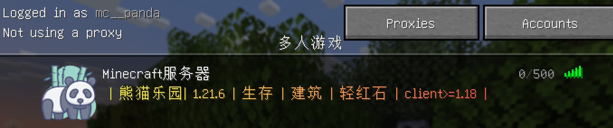

==================================================
细节的完善
==================================================
上面我们已经将整体的框架给做好了， 下面主要说一些比较碎碎的细节内容。

应对矿透的方案
==================================================
应对矿透，你可以安装一些插件来实现， 这里采用paper自带的能力支持。 

Anti-Xray 有三种不同的模式。具体说明如下：

:engine-mode =1:
    会把指定的方块（即 “hidden-blocks”，通常是钻石矿、黄金矿等需要隐藏的矿石）替换成其他 “假方块”。假方块的种类会根据维度自动选择：主世界用石头（在 Y 轴小于 0 的区域用深板岩），下界用 Netherrack（下界岩），末地用 end_stone（末地石）。
:engine-mode =2:
    不仅会替换 “hidden-blocks”（需要隐藏的矿石），还会把 “replacement-blocks”（原本用来替换的假方块，比如石头、下界岩等）也一起替换掉，换成随机生成的 “hidden-blocks”（即随机矿石）。简单说就是真假方块混在一起随机替换，让透视作弊更难分辨。
:engine-mode:=3:
    工作原理和模式 2 类似，但不是对每个方块都进行随机替换，而是按区块的 “层” 来随机化方块。比如一个区块纵向分成多层，每层内的方块统一随机替换，减少了完全随机带来的性能消耗，同时保持反透视效果。

对比图

.. image:: https://docs.papermc.io/_astro/anti-xray-overworld.CWzmAZnN_ZH414S.webp

简单总结：

- 模式 1：用对应维度的普通方块（石头、下界岩等）伪装矿石，性能消耗低。
- 模式 2：矿石和普通方块都随机换成矿石，反作弊效果强，但更吃性能。
- 模式 3：按区块分层随机替换，平衡了效果和性能，是模式 2 的优化版。

具体配置文档参考https://docs.papermc.io/paper/anti-xray/ 这个文档， 具体每个世界都需要按照你的需求在世界里面放置不同的策略。

- 模式1参考配置： https://docs.papermc.io/paper/anti-xray/
- 模式2参考配置: https://docs.papermc.io/paper/anti-xray/
- 模式三参考配置： https://docs.papermc.io/paper/anti-xray/

应对掉落物和动物繁殖过多问题
==================================================

这里建议使用插件方式的， 具体可以参考 :ref:`性能优化插件` 

登录分区的优化
==================================================

.. code-block:: bash 

    # 禁止生成野怪 
    server.properties文件修改 spawn-monsters=false

    # 设置出生点点位
    # essentials的setspawn让我们已经禁用了，这里使用。
    /huskhomes:setspawn  
    # 注意找好位置，确保出生点在安全区域，出生点放置到npc, 可以交互。
    #
    # 设置世界大小范围
    修改dl1分区的server.properties文件，将max-world-size=20或者适当大小。 避免用户在等登录区域乱跑，乱挖矿。

proxy的motd优化
==================================================
motd的为了让用户在众多列表里面可以亮眼的地方，可以选择快速进入的。 
具体的使用可以参考https://motd.gg/bMrZmRc9 这个平台。 

效果图如下

比如我的配置如下。 

.. code-block:: bash 

    # 文件/home/mc/instances/proxy/velocity.toml
    motd = "<gradient:yellow:red> | 熊猫乐园| 1.21.6 | 生存 | 建筑 | 轻红石 | client>=1.18 | </gradient>"

proxy的图标优化
==================================================
上面的效果图里面我们展示了图标，这个需要放置一个图标。

- 文件命名：必须将图标文件命名为 `server-icon.png`，包括文件名和扩展名都要准确无误，不能有其他字符或不同的文件名，否则服务器无法正确识别。
- 文件格式：图标文件需为 PNG 格式。虽然有些情况下其他格式可能会自动转换为 PNG，但为了确保兼容性和正常显示，建议直接使用 PNG 格式的图片。
- 文件尺寸：图片的分辨率应为 64×64 像素。尺寸过大或过小都可能导致图标无法正常显示或显示效果不佳。
- 放置位置：应将图标文件放置在服务器的根目录下（proxy下），即与服务器的可执行文件（.jar 等）在同一目录中

配置NPC
==================================================

这个部分前面的文档已经介绍了。 建议直接读取 :ref:`配置NPC` 

配置经济排行版
==================================================
经济排行榜，xconomy+全息图来提供。 需要进入游戏里面进行设置。

先看看效果图吧。

.. image:: ./imgs/经济排行榜.jpg

.. code-block:: bash 

    /dh h create top_money

    # 标题行（彩虹动画+加粗）
    /dh l add top_money 1 <RAINBOW1>&l===== 全服财富排行榜 Top10 =====</RAINBOW>

    # 第1名（金色RGB+火焰符号+加粗）
    /dh l add top_money 1 &l🏆 #1: <#FFD700>%xconomy_top_player_1%</#> - <#FFA500>%xconomy_top_balance_formatted_1%</#>

    # 第2名（银色RGB+奖牌符号+加粗）
    /dh l add top_money 1 &l🥈 #2: <#C0C0C0>%xconomy_top_player_2%</#> - <#E0E0E0>%xconomy_top_balance_formatted_2%</#>

    # 第3名（铜色RGB+奖牌符号+加粗）
    /dh l add top_money 1 &l🥉 #3: <#CD7F32>%xconomy_top_player_3%</#> - <#D2B48C>%xconomy_top_balance_formatted_3%</#>

    # 第4名（基础颜色）
    /dh l add top_money 1 &7#4: %xconomy_top_player_4% - &6%xconomy_top_balance_formatted_4%

    /dh l add top_money 1 &7#5: %xconomy_top_player_5% - &6%xconomy_top_balance_formatted_5%

    # 第6名（基础颜色）
    /dh l add top_money 1 &7#6: %xconomy_top_player_6% - &6%xconomy_top_balance_formatted_6%

    # 第7名（基础颜色）
    /dh l add top_money 1 &7#7: %xconomy_top_player_7% - &6%xconomy_top_balance_formatted_7%

    # 第8名（基础颜色）
    /dh l add top_money 1 &7#8: %xconomy_top_player_8% - &6%xconomy_top_balance_formatted_8%

    # 第9名（基础颜色）
    /dh l add top_money 1 &7#9: %xconomy_top_player_9% - &6%xconomy_top_balance_formatted_9%

    # 第10名（基础颜色）
    /dh l add top_money 1 &7#10: %xconomy_top_player_10% - &6%xconomy_top_balance_formatted_10%

    # 底部更新提示（灰色渐变）
    /dh l add top_money 1 <#888888>数据每5分钟自动更新</#AAAAAA>

